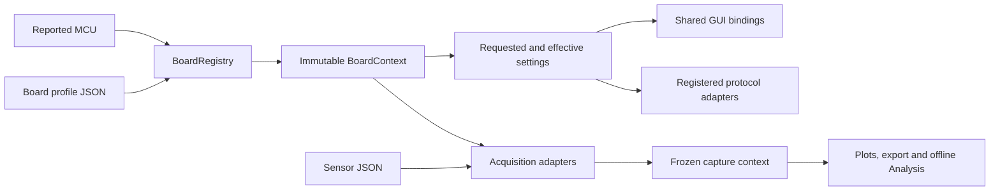

# Board registry

Board parameters have one owner: versioned files in `profiles/`. Sensor positions,
channel order, PZT-to-ADC routes and array-to-ADC associations have one owner:
`sensors_library/sensor_configurations.json` (or the user's saved sensor library).
Python holds the shared algorithms, registered adapters and existing GUI layout.

Acquisition and rendering use the shared `acquisition_runtime`,
`array_acquisition`, `array_scan`, `acquisition_worker`, `live_acquisition` and
`array_panel` modules. ADC counts and physical array IDs derive from the selected
profile and sensor layout. Board-named modules are compatibility facades; they
do not implement a separate acquisition pipeline.

`registry.json` lists the profiles and discovery transport. Resolution trims and
case-folds identity, checks exact aliases, then applies explicitly ordered family
matches, then uses `generic_adc`. Stable profile IDs also work in sensor JSON.
Duplicate aliases, IDs, family priorities/patterns, invalid defaults, reserved
channels and unknown adapter IDs fail validation. Definitions load once per app
process; restart after editing profile JSON.
Increment `profile_version` when changing interpretation or behavior. Fingerprints
include resolved shared timing data, while captures retain the data themselves.

## Parameter contract

Each mode defines `parameters`, `adapters`, `scaling`, `features`, `rules` and
`emitted_adc_lanes`. Presentation properties derive from these definitions;
features contain only the remaining presentation policies.
`schema.json` documents the version-1 authoring contract. Startup uses the typed
validator in `validation.py`, including cross-field constraints the schema alone
cannot express. `models.py` exposes immutable `BoardProfile`, `ModeProfile`,
`Parameter` and `BoardContext` objects. There is no JSON inheritance or eval.

A parameter uses a semantic ID, type, default and either choices or numeric
bounds. It may define label, tooltip, section, order, display scale/unit/precision,
command and an old state key. Enum choices own stable IDs, labels, wire values,
input aliases and, for references, numeric `full_scale_volts`. Widgets keep IDs
in item data. Hz is canonical; TestBoard displays MHz using `display_scale`.

Policies are `editable`, `fixed`, `config_file_only` and `reported`. Fixed/file-only
values always come from the profile, even if an old settings file disagrees.
Reported parameters are hidden from acquisition editing and never sent as extra
configuration commands. Unsupported parameters are absent, rather than disabled
dummy options. General transport safeguards and mathematical constants remain
in their existing modules.

Rules use a parameter/equality predicate and `force`, `effective`, `enabled` or
`visible` actions. They run in declaration order through one evaluator. TestBoard
Vmid forces manual sequence; auto1 retains requested settling repeat but applies
effective repeat 1. Turning Vmid off leaves manual selected. The GUI and Configure
request use the same evaluator. Acquisition controls lock during capture;
Display Array is a separate view control.

Existing named widgets remain in their established panels. Extra enum, integer,
number, boolean and text parameters use generic widgets. A parameter with an
existing scalar-command contract can declare `command`; algorithm changes require
a Python adapter. The shared frame codecs retain the existing AA55/LE16/footer
format, including combined PZT_RS, whose wire samples are also uint16.

## Capture and preferences

Modes may define `streaming: {"pipeline": "batched_timed_sweeps",
"render_interval_ms": 200}`. This selects the existing high-rate reader/decoder/
worker/archive pipeline without checking a PCB name. Batched timed-u16 capture
requires `multi_array` acquisition, a compatible timed-u16 codec, one emitted
result per route and one sweep per frame; startup validation enforces those
constraints. Omitted streaming settings select `legacy_blocks`. Queue/batch
budgets remain shared transport safeguards, and the ADS7953 configuration keeps
the verified values and render cadence. Stopped diagnostics belong to the
protocol adapter. See [architecture and measured replay results](../../docs/architecture/gui/GUI_GENERIC_ACQUISITION_REFACTOR.md).

Preferences live at `~/.adc_streamer/last_used_board_settings.json`, grouped by
profile ID and mode, using the existing JSON persistence helpers. TestBoard
intentionally returns to accepted defaults on reconnect; other modes preserve
their own settings. Invalid individual saved values fall back to the definition.

New archives/exports include `board_context`: identity, versions, fingerprint,
mode/variant, hardware, resolved interpretation definitions, requested/effective
settings, reported status, numeric ADC scaling, channel specs and sensor snapshot.
It remains stable after Stop, disconnect, configuration changes or profile edits.
TestBoard descriptors are now version 2 and retain the older metadata fields.
Version-1 descriptors and captures without registry metadata retain compatibility
readers. Offline validation uses the captured contract, not installed profiles.
Neither user sensor files nor old captures are automatically rewritten.

`MCUProfile`, legacy snapshot/state fields, `testboard_7953_board.py` imports and
historical constants remain read-only compatibility facades. Their values now
come from the JSON owners. New parameters use the registered parameter mapping;
they do not require another dataclass field. The former Python
`TESTBOARD_DEFAULT_SCAN_ORDER` setting is superseded by
`profiles/testboard_7953.json` → `modes.PZT.parameters.scan_order.default`.

## Adding a board

1. Audit its firmware identity, commands/ACKs, frame, modes, numeric scaling,
   physical capacities and defaults. Select existing adapters when compatible.
2. Add an explicit profile JSON, give it a stable ID and unique MCU aliases, and
   list it in `registry.json`. Include provenance and any revision ambiguity.
3. Populate modes and supported parameters. Copying a compatible profile is a
   starting point; review capabilities, scaling, bounds and transport explicitly.
4. If it has sensor arrays, add its layout/mappings and `board_profile` to sensor
   JSON. Reserved roles belong to the board profile; actual routes belong to the
   sensor library. Five-position PZT algorithms declare their input requirements;
   raw sensor mappings can have another number of positions.
5. Run `python -m config.boards.audit` and focused tests. Restart the GUI, check
   controls, then verify Configure/status, capture, display and export on hardware.

`registry.json.standalone_firmware` records identities with standalone tools but
no implemented desktop GUI profile/protocol. The connection workflow rejects
these explicitly and releases the port. Remove an entry when adding its audited
GUI support; do not let unsupported firmware inherit generic ADC settings.

`tests/test_board_registry.py` demonstrates a JSON-only future board with a new
reference/wire token, different repeat bounds, 16-bit ADC, additional scalar
parameter and two-position sensor mapping. Its GUI, commands, frozen export and
offline scaling work without adding production board-name branches.

## Firmware compatibility and hardware validation

See [coverage.md](coverage.md) for the complete inventory. TEENSY40 uses active
firmware OSR 2/4/8 and fixed 3.3 V; historical Teensy averaging retains its own
profile. Array_PZT_PZR1 cannot identify PCB1.0 versus PCB1.5. Its explicit variants
record that ambiguity; the historical host PZT_RS option remains, and an actual
firmware rejection prevents Start. No new firmware support is inferred.
`BoardRegistry.context(..., variant='pcb1.0')` is an explicit variant path and
rejects modes absent from its declared firmware modes; identity alone never
selects a revision. The GUI retains the existing compatibility choice by default.

Discovery preserves the shared USB bootstrap at 460800 baud and the historical
`***` delimiter (firmware accepts repeated `*`). Once identified, the session
uses the profile transport. Teensy555 records its sketch's 115200 baud; USB CDC
does not use that value as UART framing. A future physical UART board with a
different discovery rate needs an explicit discovery strategy before identification.

Software regressions do not prove physical timing or SPI frequency. On hardware:
check each active identity and mode, Configure ACK/status, channel order and
voltage scaling; check TEENSY40 OSR 2/4/8; check legacy pair modes and held RS units;
check TestBoard both references, each/both arrays, all profile scan orders, manual
repeat 1/3, auto1 and Vmid, live Display Array switching, Stop/disconnect and reload.
Above 20 MHz remains experimental; the saved SPI clock is requested, not measured.
ADS7953 physical connection timing remains unavailable.
