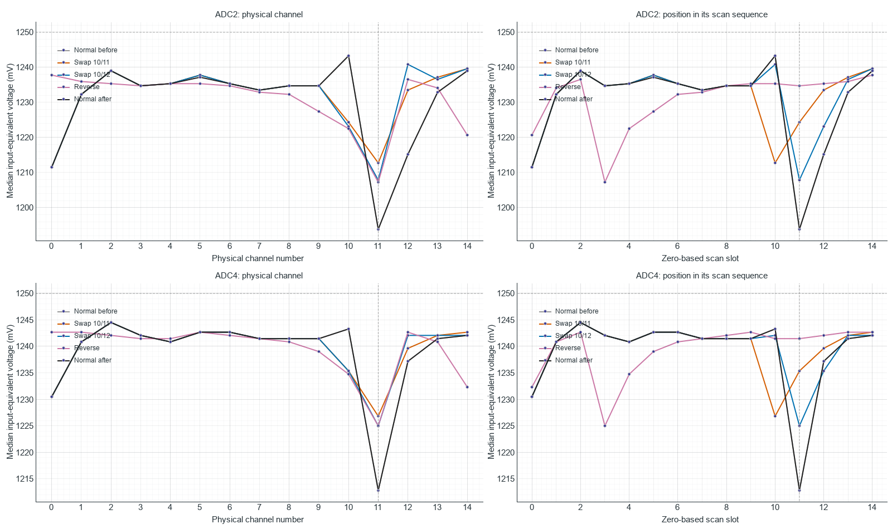

# TestBoard 7953: channel 11 firmware and scan-history investigation

Reviewed 2026-10-08. The user has closed the shared burst-noise investigation
and requested a focused investigation of the low ADC2/ADC4 channel-11
baseline. Both sensor strips remain unplugged and the GUI is disconnected.
Existing firmware changes and the wire protocol are preserved.

**2026-10-09 four-ADC follow-up:** Completed 40 captures covering all ADCs,
channels 0–14, 5/10/20 MHz, optional Vmid off/on, isolated channel-11 holds,
and explicit channel-15 reference controls. With Vmid off, channel 11 is low
relative to channels 10/12 on ADC2/ADC4, but slightly higher on ADC1/ADC3.
Insertion makes channel 11 lower than its neighbors on all four ADCs. The
measured reference stays at 1248.78–1249.39 mV. Production firmware was
restored after using an isolated diagnostic build to export channel 15.
See [all graphs, methods and results](../../testing/results/testboard-7953/gui-noise-analysis/channel11_four_adc/report.md).

**Sensors-attached follow-up:** The user has since reconnected both strips
and repeated the optional Vmid off/on/off comparison with unstressed sensors.
Channel 11 remains low; insertion has a much smaller effect on it than with
unplugged strips and helps ADC2 channel 12 substantially. See [the attached-sensor report](../../testing/results/testboard-7953/TESTBOARD_7953_VMID_SENSORS_ATTACHED_RESULTS.md).

**Subsequent Vmid control:** The existing optional reference-insertion command
has now been tested off/on/off. Channel 11 falls further on ADC2/ADC4 and
returns to its earlier baseline when insertion is disabled. The intervention
also changes sweep cadence. See [the Vmid baseline results](../../testing/results/testboard-7953/TESTBOARD_7953_VMID_BASELINE_RESULTS.md)
for all channel comparisons and validation.

**Bias topology clarification:** The user confirms one Vmid bias resistor
per ADC, connected at the shared MXO / OPA365 input, rather than one resistor
at each channel input. With the sensor strips unplugged, the individual MUX
inputs therefore lack individual Vmid bias. The disconnected captures do
not compare fifteen independently driven 1.25 V sources. They include
selection of floating channel inputs, their charge history and their
connection to a high-resistance-biased common node. This is a material
distinction for interpreting the baseline offsets.

## Firmware source findings

No channel-11-specific delay, correction, mask, conversion count or branch
was found in the active TestBoard_7953 acquisition path. This is a source
finding, not proof that every actual channel-to-channel interval is equal:
interrupts, peripheral behavior and analog settling require measurement.

- `src/Ads7953Adc.cpp:33`: manual commands are generated uniformly as
  `0x1800 | ((channel & 0x0F) << 7)` for the 1xVref range. Channels 10/11/12
  produce 0x1D00/0x1D80/0x1E00. Range, power-down and GPIO-control bits
  are identical; the channel-address bits differ as intended.
- `src/PztController.cpp:336`: scan-plan construction preserves input-list
  order within each ADC. Changing `scanorder` alone changes payload order
  but does not change the relative physical channel order within each ADC.
- `src/PztController.cpp:440`: each route receives the same configured
  repeat count; only the final same-channel conversion is retained.
  Optional Vmid insertion is uniform between routes. With repeat 1 and
  optional Vmid off, channels 10, 11 and 12 are ordinary interior operations.
- `src/PztController.cpp:681`: manual responses pass through a two-entry
  pipeline, validate the returned physical channel tag, mask the same 12
  sample bits, and store the same unsigned sample type in the planned slot.
- `src/PztController.cpp:845`: ADC1/ADC3 run as one pair, followed by ADC2/ADC4.
  In the full 50-route configuration their stream lengths are 12/12 and
  17/17 operations respectively (including two drain operations). The
  ten-channel ADC1/ADC3 streams finish before the ADC2/ADC4 streams begin;
  there is no short-stream completion boundary at ADC2/ADC4 channel 11.
- `src/SpiController.cpp:66`, `include/SpiController.h:31`: SPI transfer
  configuration and the explicit 40 ns CS-high guard are channel-independent.
  Blocking transfers bus 1 before bus 2 for each pair; DMA/LPSPI start both
  buses before waiting. This changes cadence across engines, without a
  specific rule for channel 11.
- `src/ApiProtocol.cpp:9`: the sample array is copied unchanged to the wire
  payload. USB transmission happens after acquisition and does not modify
  the channel-11 value.

At repeat 1, channels 0 through 14 are followed by two Vmid/channel-15
commands when both ADCs on a bus are active. For an isolated ADC the two
drain commands repeat the last channel instead. This changes scan history
between topology tests, but does not single out interior channel 11.

## Manual-mode pipeline near channel 11

Zero-based SPI frame indices within the ADC2/ADC4 stream, ascending order,
repeat 1, optional Vmid off:

| Frame | Command sent | MUX selection during frame | Sample converted/returned |
| --- | --- | --- | --- |
| 10 | Channel 10, 0x1D00 | Channel 9 | Channel 8 |
| 11 | Channel 11, 0x1D80 | Channel 10 | Channel 9 |
| 12 | Channel 12, 0x1E00 | Channel 11 | Channel 10 |
| 13 | Channel 13, 0x1E80 | Channel 12 | Channel 11 |
| 14 | Channel 14, 0x1F00 | Channel 13 | Channel 12 |
| 15 | Channel 15, 0x1F80 | Channel 14 | Channel 13 |

ADC2 channel 11 stores at payload index 21; ADC4 channel 11 at index 46.
Neither shares a destination with its neighbors. The trace in the retained
JSON reconstructs the reviewed source logic and checks all 15 destinations
per ADC; it does not instrument the firmware binary or measure CS edges.

TI documents a two-frame manual-command latency. MUX selection occurs on
the second SCLK falling edge, acquisition begins on the fourteenth rising
edge, and sampling occurs at the next frame's CS falling edge. Thus time
between channel selection and sampling, and the preceding selected channel,
matter; the nominal SPI clock or whole-sweep timestamp alone does not
measure that interval. See
[ADS7953 datasheet, sections 8.1 and 8.4.4](https://www.ti.com/lit/ds/symlink/ads7953.pdf).

## Retained capture evidence

Post-warm-up medians from the earlier, independently validated 10 MHz
blocking full-array benchmark, both strips unplugged:

| ADC | Channel 10 | Channel 11 | Channel 12 | Channel 13 | Channel 14 |
| --- | ---: | ---: | ---: | ---: | ---: |
| ADC2 | 2036 | 1955 | 1990 | 2019 | 2029 |
| ADC4 | 2037 | 1986 | 2027 | 2034 | 2035 |

The channel-11 drop is followed by lower channel-12 readings and subsequent
recovery, especially on ADC2. The pattern also exists with each ADC scanned
alone. This is consistent with scan-history or settling sensitivity; these
medians alone cannot show whether a physical channel voltage, MUX switching
disturbance or digital activity initiates the effect.

The earlier GUI repeat-3 control, with sensor strips still attached, raised
ADC2/ADC4 channel-11 medians by 51/38 counts. Slower SPI and adding the opposite
array also change the baseline. These observations make dynamic behavior
more plausible than a single fixed software subtraction. They do not
uniquely identify settling because repeat and topology also change revisit
time and loading. No returned-channel errors were reported.

The OPA365 between MXO and AINP does not isolate a high-impedance input from
charge retained at MXO. TI explicitly discusses this limitation for a buffered
MUX, so matching PCB routes do not establish matching dynamic behavior for
every internal MUX address. This is an inference applicable to this topology,
not a measured OPA365 defect or a claim that TI identifies channel 11 as
exceptional. See
[ADS7953 datasheet, section 9.2.2](https://www.ti.com/lit/ds/symlink/ads7953.pdf).

## Channel-order controls

The existing benchmark runner's dry runs accept all four route manifests.
Each retains the same 50 physical routes, the same ADC pairings and stream
lengths, 10 MHz blocking/manual/repeat-1, Vmid-between-channels off and profile
off. Only ADC2/ADC4 route order changes; normal order is captured before and
after to check drift and restore the run configuration.

1. Normal: channels 0 through 14.
2. Swap 10/11: move physical channel 11 one slot earlier, and channel 10 into
   its previous slot. This tests whether the deepest drop follows a slot.
3. Swap 10/12: keep physical channel 11 in the same slot, but change its
   predecessor from channel 10 to channel 12 and its successor from 12 to 10.
   This tests sensitivity to neighbors and serial command history at the same
   scan position.
4. Reverse: channels 14 through 0. Channel 11 moves from slot 11 to slot 3,
   with different predecessor/successor. Reversal also changes first/last
   channels, so it is a broader corroborating control.
5. Normal again: restore the original order and compare with the first run.

These controls are programmed with the existing `adcchannels` command.
They require no firmware edit or upload. If an offset follows a scan slot,
position-dependent timing/activity becomes a stronger candidate. If it stays
with physical channel 11, address-dependent switching, the analog input path
or electrical coupling remains possible; that outcome alone cannot separate
an internal MUX property from address-specific digital interference. If a
depressed successor follows channel 11, that supports analog memory/settling.

## Channel-order results

All five order controls completed successfully. Each retained 50 physical
routes and had a median received period of 136 us. All 250 independently
calculated channel medians match the benchmark channel CSVs; all ADC/channel,
SPI-start, timeout and USB-write counters are zero. The raw fixed-width
headers/counts/values, device timestamps and firmware frame totals pass
independent checks. There are 477,871 retained sweeps (23,893,550 values)
and 73 USB-busy discards across the five captures.

| ADC2 median, counts | Ch10 | Ch11 | Ch12 |
| --- | ---: | ---: | ---: |
| Normal before | 2037 | 1956 | 1991 |
| Swap 10/11 | 2006 | 1987 | 2021 |
| Swap 10/12, channel 11 remains in slot 11 | 2004 | 1979 | 2033 |
| Reverse | 2003 | 1978 | 2026 |
| Normal after | 2037 | 1956 | 1991 |

| ADC4 median, counts | Ch10 | Ch11 | Ch12 |
| --- | ---: | ---: | ---: |
| Normal before | 2037 | 1987 | 2027 |
| Swap 10/11 | 2024 | 2010 | 2031 |
| Swap 10/12, channel 11 remains in slot 11 | 2024 | 2007 | 2035 |
| Reverse | 2023 | 2007 | 2036 |
| Normal after | 2037 | 1987 | 2027 |

One nominal count is 0.6103515625 mV. Moving channel 11 one slot earlier
raises its reading by 18.92 mV on ADC2 and 14.04 mV on ADC4. Keeping channel
11 in the same slot but changing its neighbors raises it by 14.04/12.21 mV.
Reversing the scan moves its low reading to slot 3; the deepest interior
drop does not remain at slot 11. When channel 10 follows channel 11 it
becomes depressed, while channel 12 improves when moved before channel 11.
These observations establish sequence dependence and weaken a hypothesis
of an exceptional software delay at the eleventh slot. The before/after
medians for these three channels match exactly on both ADCs.

## Continuous-selection controls

After the user clarified the single shared MXO bias resistor, additional
controls hold ADC2 and ADC4 on physical channel 10, 11 or 12 continuously.
Each capture has one route per ADC, with no other active ADC on either bus.
The manual stream sends the selected channel followed by two commands for
the same channel; optional Vmid is off. After the initial run parking and
pipeline priming, there is no repeated switch to another channel during
the measurement. Each hold has one second warm-up and four seconds measured.

| Continuously selected channel | ADC2 median, counts | ADC4 median, counts |
| --- | ---: | ---: |
| 10 | 2027 | 2033 |
| 11 | 2021 | 2032 |
| 12 | 2019 | 2030 |

The large channel-11 difference is mostly absent: channel 11 is 3.66 mV
below held channel 10 on ADC2 and only 0.61 mV below on ADC4; it is two
counts higher than held channel 12 on each ADC. Compared with the full
normal scan, holding channel 11 raises its median by 65/45 counts, or
39.67/27.47 mV. Thus channel 11 does not intrinsically produce the much
lower code when kept selected under this test configuration.

The holds have a median received period of 15 us, versus 136 us for the
full scans, and different active ADC/parking history. Consequently, the
full-scan-to-hold comparison is not a matched-cadence experiment that changes
only one variable. The three held-channel comparisons have the same active
ADCs, route counts, clock, engine and modifiers and are a useful check for
a large channel-specific steady-state difference. Actual Vmid/Vref and
per-channel analog voltages were not independently measured.

The leading explanation is dynamic MUX/bias-node behavior with high-resistance
shared bias and otherwise unbiassed disconnected channel inputs. Channel
selection reconnects different input charge to MXO, and insufficient recovery
can affect the next channel. The greater drop and longer recovery with ADC2's
470 kOhm bias than ADC4's 249 kOhm bias are consistent with this explanation.
Address-dependent charge injection, input leakage/capacitance, and digital
coupling remain candidates for why channel 11 is most sensitive. The reviewed
code does not identify a special channel-11 timing instruction or arithmetic
error. A fixed, low-impedance Vmid drive to the physical channel-11 input
while scanning, or simultaneous MXO/buffer-output and CS measurements,
would distinguish the remaining mechanisms more directly.

The analysis helper needed one reporting correction for a one-channel ADC:
the deficit relative to other channels is undefined when there are no other
channels, so it now writes JSON null. Both affected captures had already
passed; retained raw data were reused unchanged. Reanalysis of the preceding
21-run topology matrix reproduces all prior numerical run summaries exactly
and revalidates all 450 channel medians. No firmware/protocol source changed.

All three hold benchmarks and the final full-scan restore report PASS, with
all 56 independent channel medians matching their CSVs. The held-channel
captures have no USB discards and maximum actual periods of 20 us. The
restore has 27 USB-busy discards, maximum actual period 137 us and no periods
above 1 ms. All firmware error counters and raw wire/timestamp checks pass.
Together with the five order controls, nine captures retain 1,543,303 sweeps
and 30,611,294 raw sample values; 306 channel medians were independently
checked against the benchmark CSVs.

The final normal scan returns channels 10/11/12 to exactly the first control's
medians on both ADCs. The board is stopped, COM3 is closed, and the original
full 50-route ADC-ordered 10 MHz blocking/manual/repeat-1 configuration is
restored. All raw captures remain in their benchmark directories.

## Artifacts

- [Reviewed pipeline and retained neighboring-channel medians](../../testing/results/testboard-7953/gui-noise-analysis/channel11_firmware_audit/comparison.json)
- Four route manifests are retained in `TESTBOARD_7953_GUI_NOISE_ANALYSIS/channel11_firmware_audit`.
- Source-level reconstruction helper: `.codex_test_tmp/audit_channel11.py`.
- Hardware-control helper: `.codex_test_tmp/run_channel11_order.py`.
- Capture directory: `Arduino_Sketches/TestBoard_7953/benchmarks/results/noise_channel11_order_20261008`.
- [Validated order-control summaries and stopped status](../../testing/results/testboard-7953/gui-noise-analysis/channel11_firmware_audit/hardware/comparison.json)
- Each order-control subfolder retains its independent wire and channel-CSV validation summary.
- Hold-control helper: `.codex_test_tmp/run_channel11_holds.py`.
- Hold capture directory: `Arduino_Sketches/TestBoard_7953/benchmarks/results/noise_channel11_hold_20261008`.
- Each hold-control subfolder in `TESTBOARD_7953_GUI_NOISE_ANALYSIS/channel11_firmware_audit/hardware_holds` retains its independent wire and channel-CSV validation summary.
- [Hold-control comparison, raw hashes and final stopped status](../../testing/results/testboard-7953/gui-noise-analysis/channel11_firmware_audit/hardware_holds/comparison.json)
