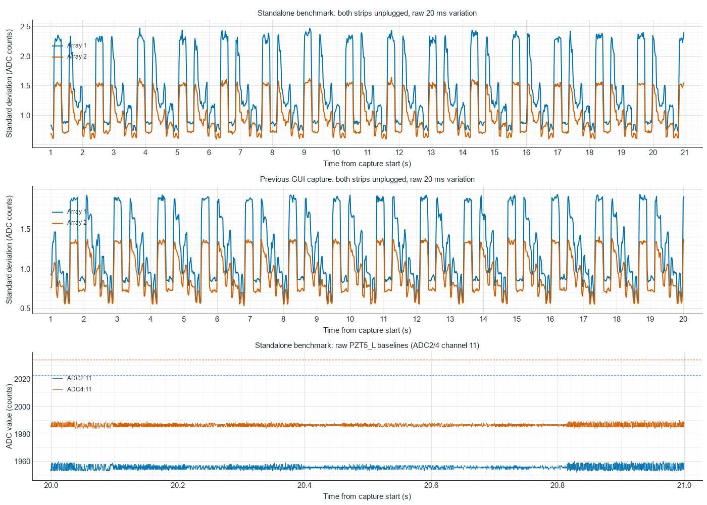

# Standalone benchmark reproduces the GUI noise observations

Follow-up completed: [21-capture SPI engine and topology comparison](TESTBOARD_7953_ENGINE_TOPOLOGY_NOISE_RESULTS.md).
All three engines retain the burst recurrence with single ADCs, single arrays,
and both arrays; the low channel-11 baseline also persists in single-ADC scans.

## Result — 2026-10-08

The independent benchmark reproduces both the periodic, coincident variation
across the arrays and the low ADC2/ADC4 channel-11 baseline labeled PZT5_L.
The GUI is disconnected from COM3 throughout this benchmark. Both sensor
strips remain unplugged; the board-side Vmid bias resistors and OPA365 unity
buffers remain connected. The existing flashed firmware is used without any
upload, firmware edit, protocol change, or GUI change.

| Measurement | Earlier matching GUI capture | Standalone benchmark |
| --- | ---: | ---: |
| Received sweeps, including first second | 147,191 | 154,407 |
| Recorded duration | 20.020 s | 20.999 s |
| Burst-envelope recurrence, each array | 1.32 s | 1.32 s |
| Correlation between array noise envelopes | 0.99558 | 0.99778 |
| Array 1 envelope standard deviation, 95th percentile | 1.900 counts | 2.354 counts |
| Array 2 envelope standard deviation, 95th percentile | 1.356 counts | 1.546 counts |
| ADC2 channel 11 median (Array 1 PZT5_L) | 1955 | 1955 |
| Median of other ADC2 channel baselines | 2022.5 | 2022.5 |
| ADC4 channel 11 median (Array 2 PZT5_L) | 1986 | 1986 |
| Median of other ADC4 channel baselines | 2034 | 2034 |

The 1.32 s figure describes the recurrence of the variation envelope, not a
measured electrical interference carrier. Amplitude differs between these
separate runs; the recurrence and the two channel-11 baselines reproduce.



## Capture and independent verification

The existing runner performs a one-second warm-up followed by a 20-second
measurement: PZT, both arrays, all 50 routes in ADC order, manual sequence,
blocking SPI, 10 MHz, repeat 1, optional between-channel Vmid off, mandatory
parking retained, reference 2.5 V, profile off. Its normal startup smoke
checks also run. The user releases the GUI serial connection first.

```powershell
.venv/Scripts/python.exe -u Arduino_Sketches/TestBoard_7953/benchmarks/testboard_7953_benchmark.py `
  --port COM3 --route-set all_four_full --scan-order adc --spi-clock-hz 10000000 `
  --tests all_four_full__adc__manual__blocking__repeat1__vmidoff__spi10000000hz `
  --window-ms 20000 --warm-up-ms 1000 --repetitions 1 --profile off `
  --defer-parsing --no-drift-controls --no-excel `
  --output Arduino_Sketches/TestBoard_7953/benchmarks/results/gui_noise_comparison_20261008_10MHz_both_disconnected
```

`--defer-parsing` drains and retains raw bytes while running, then parses
afterward. No GUI acquisition, archive writer, plotting, filtering, or
decimation participates. The runner retains binary data, channel statistics,
sample CSV, commands, session metadata, and board status automatically.
No manual GUI CSV export is necessary.

The result reports PASS and 147,053 post-warm-up sweeps. All 154,407 binary
frames including warm-up were decoded without invalid frames, discarded
bytes, resynchronization, timestamp regressions, or duplicate frames. A
separate fixed-width NumPy view verifies every header, sample count, sample
value, and start timestamp against the benchmark parser. All 50 independently
computed post-first-second channel medians match the runner's channel CSV.

Firmware diagnostics report 154,411 acquired sweeps, 154,407 transmitted and
four discarded because USB was busy. The four omissions occur in a single
received interval, 1.252384–1.253058 s (674 us); the recurring variation
persists throughout the recording. Actual sampling period is at most 137 us,
with zero periods over 1 ms. All ADC, returned-channel, transfer-timeout,
DMA/LPSPI-start and USB-write error counters are zero. The runner leaves the
board stopped and closes COM3 when finished.

Noise analysis uses complete 20 ms bins after the first second, computes
standard deviation per channel, then takes the median across the 25 channels
in each array. Raw counts and actual board timestamps are retained without
filtering or interpolation. The GUI comparison uses the backed-up, previously
validated raw arrays in the same physical ADC route order. These variation
statistics are not an isolated measurement of ADC electronic noise.

The benchmark's standard PASS thresholds are much wider than these small
bursts and baseline offsets. PASS confirms its specified checks; it does not
establish that this analog behavior is acceptable.

## What this establishes about the gap repairs

The GUI rendering and processing changes are not required to reproduce either
effect. The low channel-11 baseline was also recorded by older standalone
benchmark captures before this GUI repair; see the historical benchmark
comparison in [the accumulated investigation](gui-noise-analysis/GUI_NOISE_ANALYSIS.md).

This test does **not** isolate the earlier firmware USB/sampling changes:
the benchmark and GUI use the same existing flashed firmware. It also does
not distinguish firmware acquisition/USB activity from board analog settling,
reference/buffer coupling, or external interference. The lack of parser and
channel-tag errors does not prove the analog inputs are correct.

A read-only review of the repository's current `PztController::captureBlock`
shows acquisition and sample validation preceding frame encoding and
nonblocking USB submission. A discarded frame preserves completed ADC
pipeline and parking updates. `service()` contains the timed-run stop check,
but no explicit 1.32 s acquisition cycle. This inspection supplies no direct
cause for the burst period and does not exclude interrupt, USB, or analog
effects on subsequent sweeps.

The next firmware-oriented control should compare blocking versus LPSPI in
the same standalone benchmark using runtime commands and the existing
firmware. That changes engine and sampling cadence without another flash.
A later firmware before/after comparison must also account for changed
sampling cadence and USB workload; this single capture is not evidence
that a particular firmware commit caused the disturbance.

## Artifacts

- [Numerical comparison and raw SHA-256](gui-noise-analysis/benchmark_10MHz_both_disconnected/comparison.json)
- [Comparison plot](gui-noise-analysis/benchmark_10MHz_both_disconnected/raw_benchmark_comparison.png)
- [Reusable binary analysis script](../../../../scripts/analyze_testboard_benchmark_noise.py)
- Benchmark output directory: `Arduino_Sketches/TestBoard_7953/benchmarks/results/gui_noise_comparison_20261008_10MHz_both_disconnected`
- Raw binary SHA-256: `c2fb1286fbff1d18cfb3a99e595082e21c99c62f7d4e930fcf3a66f387949ff8`

Reproduce the analysis from the retained binary without opening a serial port:

```powershell
.venv/Scripts/python.exe scripts/analyze_testboard_benchmark_noise.py `
  Arduino_Sketches/TestBoard_7953/benchmarks/results/gui_noise_comparison_20261008_10MHz_both_disconnected/raw/all_four_full__adc__manual__blocking__repeat1__vmidoff__spi10000000hz__r1__attempt1.bin `
  --gui-npz C:/Users/shera/Documents/sensetics/data/adc/speed_tests/20261008/10MHz_both_disconnected_125137/raw_arrays.npz `
  --output docs/testing/results/testboard-7953/gui-noise-analysis/benchmark_10MHz_both_disconnected --plot
```
