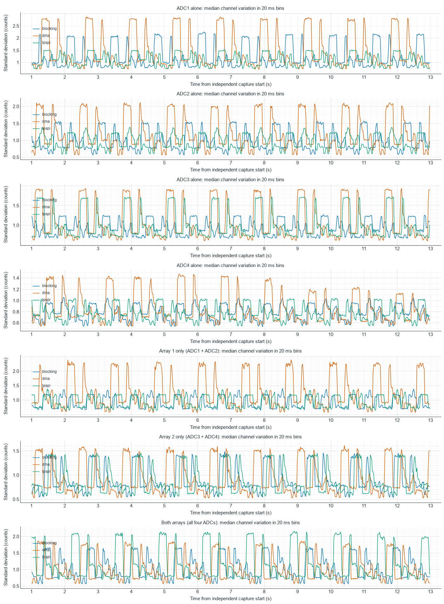
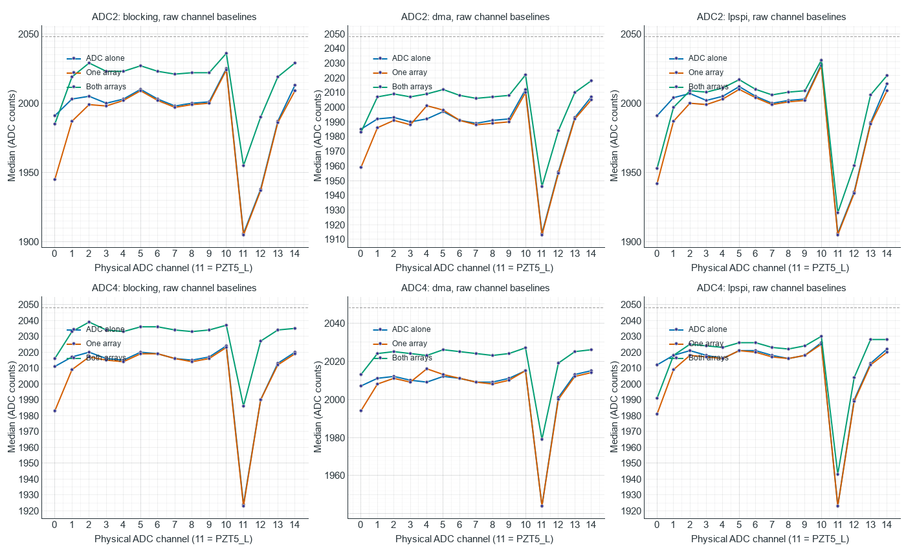

# TestBoard 7953: SPI engine and acquisition topology comparison

Measured 2026-10-08 with both sensor strips unplugged and the GUI disconnected.

**All 21 configurations retain the approximately 1.32 s burst pattern.**
The low ADC2/ADC4 channel-11 (PZT5_L) baseline also persists when each
ADC is scanned alone. Blocking, DMA and LPSPI all reproduce the symptoms.
No firmware upload, firmware edit, wire-protocol change or GUI edit was made.

## Configuration and validation

The existing benchmark runner 2.5 captures all three engines across seven
topologies: each ADC alone, each full array alone, and both full arrays.
Each configuration uses 10 MHz requested SPI, manual sequence, ADC payload
order, repeat 1, optional between-channel Vmid off, reference 2.5 V, and
profiling off. Each run includes a one-second warm-up and 12-second
measurement. One capture is taken per configuration, with seeded randomized
order (7953). Board-side Vmid bias and OPA365 buffers remain connected.

Raw bytes are drained with `--defer-parsing` and decoded afterward by the
benchmark. Normal startup smoke checks are retained. The independent
analysis checks every fixed-width wire header, count, 12-bit value and
device timestamp, rejects overlapping/backward timestamps, and reconciles
received/acquired/discarded counts with the stopped board status.
All 450 independently computed post-warm-up channel medians match the
benchmark channel-statistics CSV. All benchmark captures report PASS.

Total raw frames: **5,333,459**;
total raw sample values: **89,984,325**.
Total USB-discarded sweeps: **23**.
Largest actual sampling period: **166 us**.
All ADC/channel-tag, SPI-start, transfer-timeout and USB-write error
counters remain zero. All actual sampling-period-over-1-ms counters are zero.

The benchmark PASS thresholds are wider than the observed variations and
baseline deficits. PASS is not an analog-quality acceptance verdict.

## Actual sweep timing

Median start-to-start device time, in microseconds; received omissions are
excluded from the median naturally. Nominal SPI clock alone does not
determine scan cadence. For a channel retained once per sweep, its typical
rate is approximately `1,000,000 / period_us`.

| Acquisition topology | Blocking | DMA | LPSPI |
| --- | ---: | ---: | ---: |
| ADC1 alone | 29 | 50 | 28 |
| ADC2 alone | 41 | 71 | 39 |
| ADC3 alone | 29 | 51 | 28 |
| ADC4 alone | 41 | 71 | 39 |
| Array 1 (ADC1 + ADC2) | 68 | 120 | 65 |
| Array 2 (ADC3 + ADC4) | 68 | 121 | 65 |
| Both arrays (ADC1–4) | 136 | 166 | 82 |

## Bursts and variation

For each complete 20 ms bin after the first second, calculate standard
deviation per channel, then the median across selected channels. No
filtering, interpolation or GUI display reduction participates.
The following values are the 95th percentile of that median-channel
variation envelope, in ADC counts. They include all input variation;
they do not isolate intrinsic ADC noise. Compare the same topology
across engines; different topologies include different channel sets.

| Acquisition topology | Blocking | DMA | LPSPI |
| --- | ---: | ---: | ---: |
| ADC1 alone | 2.142 | 2.804 | 1.492 |
| ADC2 alone | 1.528 | 2.057 | 1.262 |
| ADC3 alone | 1.238 | 1.903 | 1.701 |
| ADC4 alone | 0.972 | 1.421 | 1.022 |
| Array 1 (ADC1 + ADC2) | 1.224 | 2.262 | 1.244 |
| Array 2 (ADC3 + ADC4) | 1.410 | 1.540 | 1.408 |
| Both arrays (ADC1–4) | 1.646 | 1.789 | 2.085 |

Every per-ADC envelope has its strongest autocorrelation peak between
0.5 and 2 s at **1.32 s**. Corresponding autocorrelations range from
**0.668 to 0.889**.
This describes burst-envelope recurrence, not an electrical carrier
frequency. The plots use each capture’s own time origin; engine curves
are not recordings of the same real-time event.



## PZT5_L baseline

Each table entry is `channel 11 median / deficit from other channels`
on the same ADC, in raw counts. The comparison reference is the median
of the other channels’ individual baselines, not nominal Vmid.

### ADC2 channel 11

| Acquisition topology | Blocking | DMA | LPSPI |
| --- | ---: | ---: | ---: |
| ADC2 alone | 1906 / 96.0 | 1914 / 78.0 | 1906 / 97.5 |
| Array 1 (ADC1 + ADC2) | 1905 / 94.0 | 1913 / 77.5 | 1905 / 95.5 |
| Both arrays (ADC1–4) | 1955 / 67.5 | 1946 / 62.0 | 1921 / 87.5 |

### ADC4 channel 11

| Acquisition topology | Blocking | DMA | LPSPI |
| --- | ---: | ---: | ---: |
| ADC4 alone | 1924 / 92.5 | 1944 / 67.0 | 1923 / 95.0 |
| Array 2 (ADC3 + ADC4) | 1923 / 92.5 | 1944 / 66.5 | 1923 / 94.0 |
| Both arrays (ADC1–4) | 1986 / 48.0 | 1979 / 45.0 | 1943 / 81.0 |



## Interpretation and limits

- For each engine, channel-11 baselines differ by only 0–1 count between
  scanning the ADC alone and scanning its full array. Adding the opposite
  array raises the channel-11 median by 15–62 counts relative to the
  single-ADC case. Thus same-bus switching is not required for the low
  baseline, while two-bus operation changes it substantially. This is
  consistent with sensitivity to within-scan timing or loading, but does
  not identify the mechanism. Overall sweep period alone is insufficient:
  both-array DMA is slower than blocking yet reads lower on channel 11.
- Bursts persist across all engines and when each ADC is scanned alone.
  A second ADC, same-bus device switching, two-array scheduling, and
  an engine-specific DMA/LPSPI implementation are not required to
  reproduce them.
- Channel 11 stays low on ADC2 and ADC4 even without sensors or a
  second active ADC on the bus. Its baseline depends on acquisition
  configuration. Changing the engine does not consistently remove it.
- No raw corruption, ADC channel-tag errors or >1 ms acquisition
  stalls are detected. Bursts also persist in zero-discard captures.
  USB omission events are not required to reproduce the bursts.
- These tests use the same flashed firmware throughout. Common
  acquisition code, analog coupling from MCU/SPI/USB activity,
  reference/buffer behavior, mux-input settling/leakage, and external
  interference remain possible. This is not proof of a firmware bug
  or a particular analog fault.

Topology changes both timing and scan history. In the current source,
`PztController::prepareRun()` passes `activeAdcsOnBus(adc / 2) > 1`
to `buildManualStream()` as `park_after`. When optional Vmid insertion
is off, the trailing pipeline-drain commands select channel 15 for
shared-bus operation and repeat the last channel for a lone ADC.
Start/stop parking still applies. Thus single-ADC versus array tests
are not a comparison at identical cadence and identical parking
history, even though status reports the mandatory parking policy.
No source behavior was changed for these tests.

One capture per configuration establishes reproduction, not a
statistical ranking of engines. The physical environment and analog
voltages are not independently monitored. A follow-up that fixes scan
cadence and parking history, or directly observes Vmid/Vref and buffer
outputs, would separate these causes more effectively than another
engine-only test. The low channel-11 baseline already appeared in
standalone captures predating the GUI repair; the current matrix
does not isolate the earlier firmware USB/sampling commits.

## Artifacts and reproduction

- [Numerical comparison, per-ADC statistics, routes, stopped status, and raw SHA-256 hashes](gui-noise-analysis/engine_topology/comparison.json)
- [Host-only route manifest](gui-noise-analysis/engine_topology/routes.json)
- [Independent wire analyzer](../../../../scripts/analyze_testboard_engine_topology.py)
- Retained benchmark directory: `Arduino_Sketches/TestBoard_7953/benchmarks/results/noise_engine_topology_20261008`
- Raw binaries, sample/channel CSVs, command log, stopped statuses, and session metadata remain in that directory.

After the matrix, runtime configuration was restored to both arrays, all 50
ADC-ordered routes, 10 MHz, blocking SPI, manual sequence, repeat 1, optional
between-channel Vmid off, and reference 2.5 V. The reported stopped state
was verified and COM3 closed. `restored_status.json` and `restore_commands.log`
in the benchmark directory retain that verification.

```powershell
.venv/Scripts/python.exe -u Arduino_Sketches/TestBoard_7953/benchmarks/testboard_7953_benchmark.py `
  --port COM3 --routes docs/testing/results/testboard-7953/gui-noise-analysis/engine_topology/routes.json `
  --route-set single_adc1 --route-set single_adc2 --route-set single_adc3 --route-set single_adc4 `
  --route-set full_array1 --route-set full_array2 --route-set all_four_full --scan-order adc `
  --spi-clock-hz 10000000 --tests __manual__blocking__repeat1__vmidoff__ `
  --tests __manual__dma__repeat1__vmidoff__ --tests __manual__lpspi__repeat1__vmidoff__ `
  --window-ms 12000 --warm-up-ms 1000 --repetitions 1 --profile off `
  --defer-parsing --no-drift-controls --no-excel --output PATH_TO_FRESH_OUTPUT_DIRECTORY

.venv/Scripts/python.exe scripts/analyze_testboard_engine_topology.py `
  Arduino_Sketches/TestBoard_7953/benchmarks/results/noise_engine_topology_20261008 `
  --output docs/testing/results/testboard-7953/gui-noise-analysis/engine_topology --plot
```
