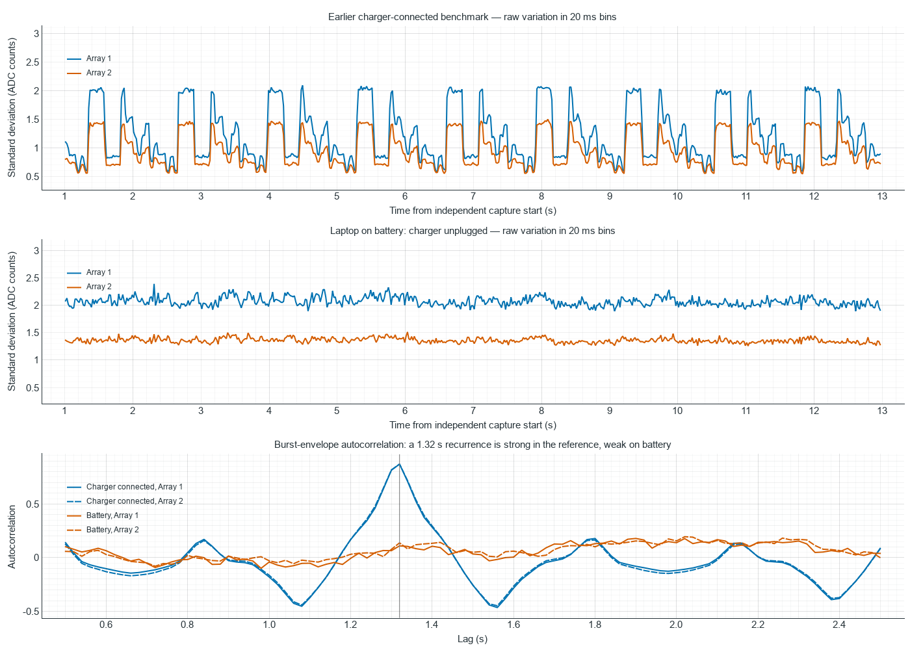
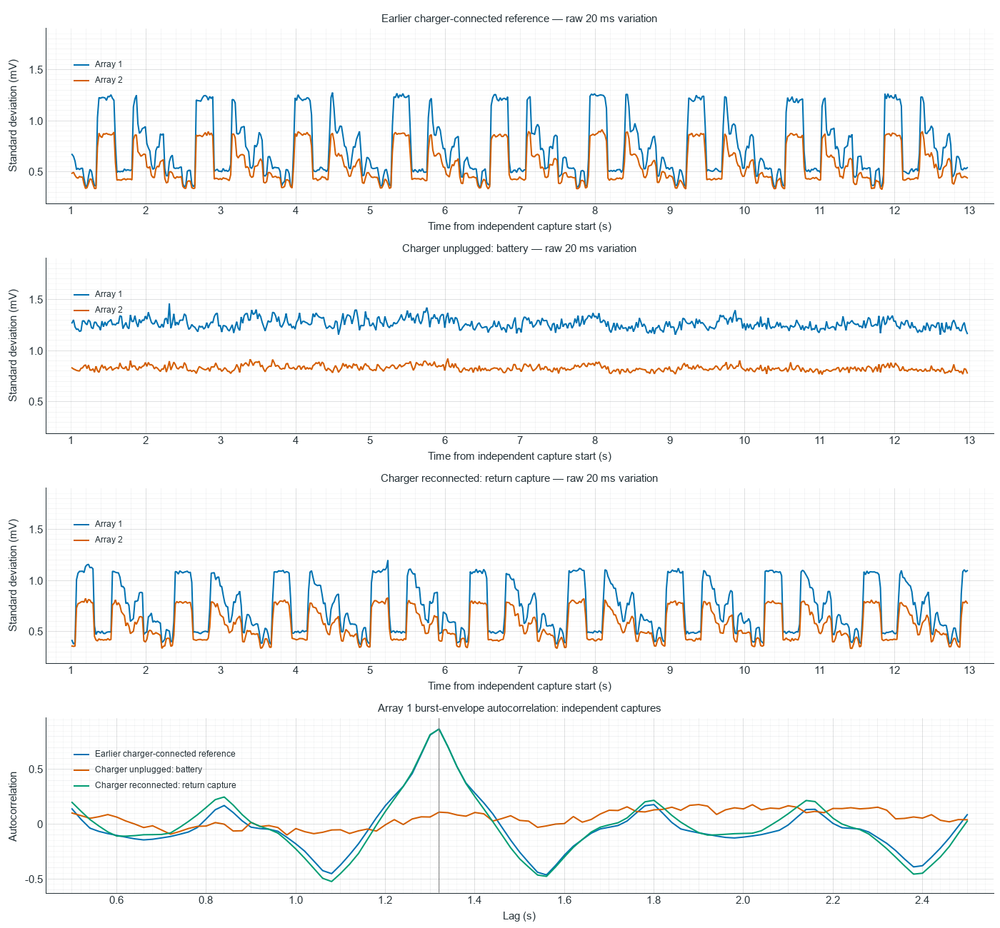

# TestBoard 7953: laptop battery control

Measured 2026-10-08 after the user disconnected the laptop charger. Both
sensor strips remain unplugged; the board still receives USB-derived 5 V.
The user states that an alternative board 5 V source is not feasible.
Firmware, wiring, protocol and GUI code remain unchanged.

**The regular 1.32 s burst pattern is no longer evident in this battery
capture, but the overall noise is not reduced.** Variation is nearly
continuous, at approximately the earlier burst levels. PZT5_L baselines
remain unchanged. This is evidence of a power-condition-related change in
the temporal pattern, not proof that the charger alone generates the noise.

**Charger return control:** The subsequent matched capture after reconnecting
the charger restores the strong 1.32 s pattern on both arrays. Quiet periods
return to approximately 0.48/0.40 mV standard deviation; burst levels are
approximately 1.10/0.80 mV. The return control is detailed below. The original
battery-versus-reference observations remain recorded separately.

## Matched capture

The standalone benchmark uses both arrays, all 50 ADC-ordered routes,
10 MHz requested SPI, blocking engine, manual sequence, repeat 1, optional
between-channel Vmid off, reference 2.5 V and profile off. Raw bytes are
drained with deferred parsing. One-second warm-up plus 12-second measurement
matches the preceding engine/topology matrix's blocking both-array control.

Windows reported `Win32_Battery.BatteryStatus=1` before the capture and after
analysis; a subsequent power-status query reports `PowerLineStatus=Offline`.
Battery charge readings were 98% before the benchmark, 96% after analysis,
and 95% at the subsequent power-status query. The earlier charger-connected
condition follows the user's account; it was not logged with this OS query.

| Measurement | Earlier charger-connected benchmark | Battery capture |
| --- | ---: | ---: |
| Duration including warm-up | 13.000 s | 13.000 s |
| Received sweeps including warm-up | 95,589 | 95,561 |
| Median sampling period | 136 us | 136 us |
| Array 1 envelope autocorrelation at 1.32 s | 0.8704 | 0.1097 |
| Array 2 envelope autocorrelation at 1.32 s | 0.8708 | 0.1376 |
| Array 1 median envelope standard deviation | 1.039 counts | 2.063 counts |
| Array 2 median envelope standard deviation | 0.797 counts | 1.354 counts |
| Array 1 envelope standard deviation, 95th percentile | 2.029 counts | 2.226 counts |
| Array 2 envelope standard deviation, 95th percentile | 1.434 counts | 1.442 counts |
| Correlation between the array envelopes | 0.9967 | 0.7591 |
| ADC2 channel 11 baseline, Array 1 PZT5_L | 1955 counts | 1955 counts |
| ADC4 channel 11 baseline, Array 2 PZT5_L | 1986 counts | 1986 counts |

The noise envelope is the median of per-channel standard deviations in each
complete 20 ms bin after the first second, calculated separately for each
25-channel array. No filtering, interpolation or GUI display reduction is
used. The reference is the raw blocking both-array capture from
`noise_engine_topology_20261008`. Configuration fields are checked for equality.



On battery the strongest autocorrelation maxima between 0.5 and 2 s are
only about 0.175–0.179. Their locations around 1.9–1.98 s are not evidence
of a replacement burst period. The important result is the loss of the
previous strong 1.32 s recurrence and quiet intervals. Typical variation
is higher on battery; the upper noise levels are similar to the reference.

## Noise strength in volts

Using the nominal 2.5 V reference and 12-bit conversion, one ADC count is
0.6103515625 mV at the ADC input. These are input-equivalent voltages computed
from the raw samples, not scope measurements of supply ripple.

| Condition | Array 1 standard deviation | Array 2 standard deviation |
| --- | ---: | ---: |
| Charger connected: quiet windows (10th percentile) | 0.459 mV | 0.391 mV |
| Charger connected: typical windows (median) | 0.634 mV | 0.487 mV |
| Charger connected: high-noise/burst windows (95th percentile) | 1.238 mV | 0.875 mV |
| Battery: quieter windows (10th percentile) | 1.203 mV | 0.797 mV |
| Battery: typical windows (median) | 1.259 mV | 0.826 mV |
| Battery: high-noise windows (95th percentile) | 1.358 mV | 0.880 mV |

The statistic measures fluctuation around each channel's local mean, rather
than its DC baseline. Each array value is the median across its 25 channels
within a 20 ms window; percentiles are then taken across 599 windows.
The standard deviation approximates RMS AC variation; it is not peak-to-peak.
The independently recalculated median and 95th-percentile statistics agree
with the earlier count-based comparison.

Relative to the charger-connected quiet level, charger bursts are 2.69 times
larger for Array 1 and 2.24 times larger for Array 2. Typical battery variation
is 2.74 and 2.11 times that same quiet level, respectively. Thus removing the
charger changes the pattern to nearly continuous variation at about the
previous burst strength, rather than restoring quiet operation.

Direct window maximum-minus-minimum statistics provide a separate scale:
the charger-connected 10th-percentile span is 1.831 mV for both arrays, while
its 95th-percentile spans are 4.272 and 3.052 mV. Battery median spans are
4.883 and 3.052 mV. These are medians across channel spans in 20 ms windows,
not whole-run worst-case ranges, and are not estimated from a Gaussian
multiple of standard deviation.

The exact statistics and source paths are retained in
[voltage_comparison.json](gui-noise-analysis/laptop_battery/voltage_comparison.json).

## Charger reconnected: return control

After the user reconnected the laptop charger, the same benchmark was run
again on 2026-10-08: one-second warm-up plus 12-second measurement, 10 MHz
blocking/manual/repeat-1, both arrays, all 50 ADC-ordered routes, optional
between-channel Vmid off and profile off. Both sensor strips remain unplugged.
No firmware was uploaded and no GUI or protocol source was changed.

Windows reported BatteryStatus=2 before and after capture; the subsequent
power-line observation is `Online`. Battery charge was 97% before and 98%
after. These observations are saved with the benchmark artifacts.

| Input-equivalent noise statistic | Earlier charger reference, A1 / A2 | Battery, A1 / A2 | Charger return, A1 / A2 |
| --- | ---: | ---: | ---: |
| Quiet/lower-level windows (10th percentile) | 0.459 / 0.391 mV | 1.203 / 0.797 mV | 0.478 / 0.405 mV |
| Typical windows (median) | 0.634 / 0.487 mV | 1.259 / 0.826 mV | 0.665 / 0.508 mV |
| High-noise windows (95th percentile) | 1.238 / 0.875 mV | 1.358 / 0.880 mV | 1.098 / 0.795 mV |
| Envelope autocorrelation at 1.32 s | 0.870 / 0.871 | 0.110 / 0.138 | 0.868 / 0.870 |

The return run again has its strongest envelope autocorrelation between
0.5 and 2 s at 1.32 s for both arrays. The raw envelope plot also reproduces
the recurring burst-and-quiet shape. Burst levels are about 9–11% lower than
the earlier charger reference, while quiet levels are about 3–4% higher.
Typical noise on battery is about 1.89 times the charger-return median for
Array 1 and 1.63 times for Array 2.

PZT5_L medians are 1956 counts on ADC2 channel 11 and 1986 on ADC4 channel 11,
versus 1955 and 1986 in both preceding captures. The Array 1 difference is
one count (0.610 mV), and the low baseline remains. The channel deficits
from their same-ADC peers are approximately 40.6 mV and 29.3 mV on return.
This baseline offset does not follow the change in burst pattern.

The return benchmark reports PASS: 95,578 received frames including warm-up,
or 4,778,900 raw values; 88,230 frames belong to the measurement window.
There are 95,586 acquired sweeps and 8 USB-busy discards (approximately
0.0084%). Median received period is 136 us; maximum actual sampling period
is 137 us, with zero periods above 1 ms. ADC/channel/SPI-start/timeout/USB-write
error counters are zero. Parser invalid frames, resynchronizations, discarded
bytes, timestamp regressions and duplicate frames are zero. Independent wire
checks pass and all 50 channel medians match the benchmark channel CSV.
All compared configuration fields match the preceding captures.



The charger-connected / battery / charger-return sequence strengthens the
association between laptop power condition and the temporal noise pattern.
It does not establish whether the coupling is through USB 5 V, ground,
host activity or another path. Battery operation still has almost continuous
noise at approximately the charger burst levels. A supply or buffer-output
scope measurement remains the useful next step; no alternative analog
supply is requested because the user has ruled it out.

The board is stopped, COM3 is closed, and the matching both-array 10 MHz
blocking/manual/repeat-1 configuration is retained. All raw captures remain.

Return artifacts:

- [Three-capture comparison, raw hashes and power observations](gui-noise-analysis/charger_reconnected/comparison.json)
- [Independent return wire/CSV validation](gui-noise-analysis/charger_reconnected/wire_validation/comparison.json)
- Benchmark directory: `Arduino_Sketches/TestBoard_7953/benchmarks/results/noise_charger_reconnected_20261008`
- Analysis helper used: `.codex_test_tmp/compare_charger_return.py` (uses the existing wire-validation and array-statistics scripts).

## User scope measurements of the PCB analog 5 V rail

The user subsequently supplied two Rigol DHO804 screenshots of the 5 V
rail after the ferrite beads and capacitors, which supplies OPA365 and
ADS7953 +VA. These are photographs of displayed scope measurements, not
exported waveform samples or captures synchronized to the benchmark.

| Displayed measurement | Charger unplugged | Charger connected |
| --- | ---: | ---: |
| Maximum | 5.1722 V | 5.1658 V |
| Minimum | 5.1109 V | 5.1128 V |
| Peak-to-peak | 61.253 mV | 53.000 mV |
| Total RMS including DC | 5.1395 V | 5.1414 V |
| Automatic period reading | 636.00 us | 239.32 ms |
| Horizontal scale | 200 ms/div | 200 ms/div |
| Vertical scale | 100 mV/div | 100 mV/div |
| Sample rate | 500 kSa/s | 125 kSa/s |
| Memory depth | 1 Mpoint | 1 Mpoint |

The battery trace appears to have almost continuous ripple amplitude, while
the charger-connected trace has blocks of greater and smaller amplitude.
This resembles the change in the raw ADC noise envelopes. It strengthens
power/ground coupling as a candidate but does not establish the direction
of causation: supply interference can affect conversions, and changing
host/board activity can also modulate supply current and rail ripple.

The measured ripple is about 1% of the rail voltage in either picture.
The displayed total RMS near 5.14 V is dominated by the DC supply level;
it is not the AC-noise RMS and cannot be directly compared with the
0.4–1.3 mV ADC-input standard deviations. Likewise, rail peak-to-peak and
ADC RMS are different statistics. The 5.11–5.17 V displayed range lies
within the ADS7953 recommended 2.7–5.25 V analog supply range and OPA365
2.2–5.5 V range; this does not establish adequate noise performance.
See the [ADS7953 datasheet](https://www.ti.com/lit/ds/symlink/ads7953.pdf),
section 7.3 and section 10, and the
[OPA365 datasheet](https://www.ti.com/lit/ds/symlink/opa365.pdf),
sections 7.3 and 7.7 (frequency-dependent supply rejection).

Neither automatic period reading identifies the 1.32 s ADC-envelope
recurrence. The displayed window is too short to establish several such
cycles. Sampling differs by four times between the screenshots; faster
ripple may be undersampled, so the apparent pulse spacing and the smaller
charger-connected Vpp should not be interpreted as a reliable frequency
or a controlled ripple-amplitude improvement.

Streaming activity, probe-ground location/length, and whether connecting
the scope changes the ADC noise pattern are pending user clarification.
A short ground spring at the local decoupling capacitor helps distinguish
actual rail ripple from probe-loop pickup. If the scope ground is
earth-referenced, connecting it can add a ground path even with the laptop
on battery. TI discusses these effects in
[ripple measurement technique](https://www.ti.com/document-viewer/lit/html/SSZTB25/GUID-725D9931-5AC3-4987-97F4-01C070E51755)
and [scope ground issues](https://www.ti.com/document-viewer/lit/html/ssztav9).

Next measurements should observe the local 5 V and an OPA365 output
simultaneously while the board streams, first for several seconds to test
the envelope timing, then at a faster timebase and sample rate to resolve
the actual ripple. Vmid and Vref at the relevant ADC/buffer pins are useful
follow-up nodes. A supply disturbance coincident with buffer-output or ADC
noise would narrow the coupling path; the photographs alone do not explain
the persistent channel-11 DC offset.

Source photographs: `C:/Users/shera/Downloads/5V_Measure_NO_Charger.jpeg`
and `C:/Users/shera/Downloads/5V_Measure_With_Charger.jpeg`.

## Battery capture integrity and limitations

The benchmark reports PASS. It received 95,561 complete frames, or 4,778,050
raw sample values including warm-up, from 95,594 acquired sweeps. The board
discarded 33 sweeps because USB was busy (approximately 0.035%). The largest
received start-to-start interval is 540 us. The largest actual sampling period
is 137 us, with zero periods over 1 ms.

All ADC/channel-tag, SPI-start, timeout and USB-write counters are zero.
The raw wire headers, counts, values and device timestamps pass independent
checks; all 50 independently computed post-warm-up channel medians match
the benchmark CSV. No resynchronization, invalid frames, discarded parser
bytes, timestamp regressions or duplicate frames are reported.

This is one short battery capture against an earlier reference, not an
immediate charger-connected / disconnected / reconnected experiment.
Changing laptop power can also change host power-management behavior.
No supply, ground or USB traffic measurements accompany the capture.
Therefore the result does not identify VBUS ripple, ground coupling, host
activity or a specific circuit as the cause. It also does not show that USB
electrical interference is absent on battery.

The charger-reconnection confirmation proposed after this battery capture
is now completed above and restores the regular pattern. Scope measurements should
compare USB 5 V before the bead, analog 5 V after it at the ADC/buffer pins,
local reference/bias and buffer output. Both slow modulation and fast ripple
matter. An independent analog supply test is excluded by the user's constraint.

The board is stopped and COM3 is closed, with the same both-array 10 MHz
blocking/manual/repeat-1 configuration retained. No raw data was cleared.

## Artifacts

- [Array comparison and raw SHA-256 hashes](gui-noise-analysis/laptop_battery/comparison.json)
- [Independent wire and benchmark-channel CSV validation](gui-noise-analysis/laptop_battery/wire_validation/comparison.json)
- [Comparison plot](gui-noise-analysis/laptop_battery/charger_vs_battery.png)
- Retained benchmark directory: `Arduino_Sketches/TestBoard_7953/benchmarks/results/noise_laptop_battery_20261008`
- Raw binary, sample/channel CSVs, command log, stopped status and session metadata remain in that directory.

Reproduce the benchmark using a fresh output directory:

```powershell
.venv/Scripts/python.exe -u Arduino_Sketches/TestBoard_7953/benchmarks/testboard_7953_benchmark.py `
  --port COM3 --route-set all_four_full --scan-order adc --spi-clock-hz 10000000 `
  --tests all_four_full__adc__manual__blocking__repeat1__vmidoff__spi10000000hz `
  --window-ms 12000 --warm-up-ms 1000 --repetitions 1 --profile off `
  --defer-parsing --no-drift-controls --no-excel --output PATH_TO_FRESH_OUTPUT_DIRECTORY
```
