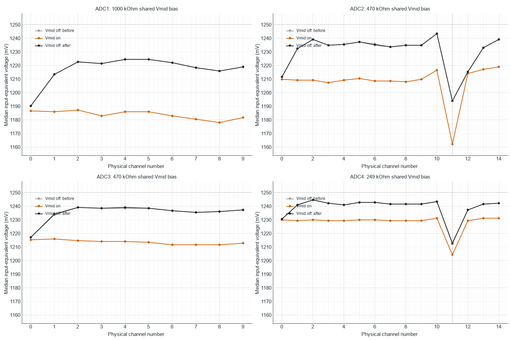

# TestBoard 7953: Vmid-between-channel baseline control

Measured 2026-10-08 using the existing firmware and standalone benchmark.
Vmid insertion does not remove the ADC2/ADC4 channel-11 deficit. Its absolute
baseline falls further, reversibly, when insertion is enabled. No firmware
was edited or flashed and the wire protocol remains unchanged.

**Sensors-attached follow-up:** The same off/on/off comparison was repeated
after the user reconnected both strips. The channel-11 deficit persists;
ADC2's insertion response shrinks to -3.05 mV and ADC4's small apparent
increase does not reverse in the final off control. ADC2 channel 12 recovers
by 13.43 mV with insertion. See [the attached-sensor results](TESTBOARD_7953_VMID_SENSORS_ATTACHED_RESULTS.md).

## Method

Three sequential captures: Vmid off, on, then off again. Each uses one
second of warm-up and twelve seconds of measurement, all 50 normal
ADC-ordered routes, both arrays, 10 MHz SPI, blocking engine, manual mode,
repeat 1, nominal 2.5 V reference and profiling off. Both sensor strips
remain unplugged, the GUI disconnected and the laptop charger connected.
Each ADC has one bias resistor at shared MXO / OPA365 input, rather than
separate bias resistors on the disconnected channel inputs.

The existing `vmid true` command enables the implementation in
`Arduino_Sketches/TestBoard_7953/src/PztController.cpp:440`: two channel-15
operations after every sensor-channel command. These accommodate the
two-frame manual pipeline. At repeat 1 the command sequence becomes
`0,15,15,1,15,15,...`. Vmid conversion results are discarded; the payload
still contains the same 50 sensor-route values. Thus this experiment tests
insertion of reference-channel selections, but does not independently
record channel-15 voltages. ADC1/ADC3 streams grow from 12 to 30 operations
each; ADC2/ADC4 from 17 to 45 each. The normal configuration retains its
mandatory end-of-stream Vmid parking even when optional insertion is off.

Baseline values below are medians after warm-up. Nominal input-equivalent
voltage uses 2500/4096 = 0.6103515625 mV per count; actual Vref and Vmid
were not measured during these captures.

## Channels 10 through 12

| ADC / channel | Off before, counts | On, counts | Off after, counts | On minus mean of off controls, mV |
| --- | ---: | ---: | ---: | ---: |
| ADC2 / 10 | 2037 | 1993 | 2037 | -26.86 |
| ADC2 / 11 | 1956 | 1904 | 1956 | -31.74 |
| ADC2 / 12 | 1991 | 1989 | 1991 | -1.22 |
| ADC4 / 10 | 2037 | 2017 | 2037 | -12.21 |
| ADC4 / 11 | 1986 | 1973 | 1987 | -8.24 |
| ADC4 / 12 | 2027 | 2014 | 2027 | -7.93 |

Channel 11 remains the lowest channel on ADC2 and ADC4. Its nominal voltage
on ADC2 moves from 1193.85 to 1162.11 mV. On ADC4 it moves from approximately
1212.46 mV (mean of off controls) to 1204.22 mV.

Absolute voltage and channel uniformity are distinct here. ADC2 channel 11's
deficit relative to the median of its other channels grows from 40.89 to
47.30 mV. ADC4's deficit narrows from approximately 28.99 to 25.33 mV because
its peer baselines also fall. That small relative improvement does not
restore channel 11 toward nominal Vmid.

## Other channels and rate

The plot and CSV retain all 50 channel comparisons. The two off controls
agree within one count (0.61 mV) across all channels. The Vmid-on run lowers
every channel's median relative to the mean of those controls.

| ADC | Off-before baseline spread, mV | Vmid-on spread, mV | Off-after spread, mV |
| --- | ---: | ---: | ---: |
| ADC1 | 34.18 | 9.16 | 34.18 |
| ADC2 | 49.44 | 56.76 | 49.44 |
| ADC3 | 21.97 | 4.27 | 21.97 |
| ADC4 | 32.35 | 26.86 | 31.74 |

Spread is maximum minus minimum channel median within each ADC, not
time-domain noise. ADC1/ADC3 become more uniform while shifting downward;
ADC2's spread grows and ADC4's narrows modestly.

Median received sweep period increases from 136 to 346 us, reducing the
per-channel rate from approximately 7.35 to 2.89 kHz (61% reduction).
Median acquisition duration increases from 134 to 345 us. Maximum actual
sampling period is 137/346/137 us for off/on/off, with no periods above 1 ms.

## Interpretation and limits

This intervention has a repeatable, reversible effect on measured baselines
and does not solve the channel-11 discrepancy. Combined with the earlier
channel-order and continuous-selection controls, it further demonstrates
dependence on acquisition conditions. It does not isolate the physical
mechanism: Vmid insertion changes MUX history, serial command transitions,
conversion count, channel revisit time and sweep cadence together. No
per-channel CS timing or MXO/buffer voltage was instrumented.

Because the unplugged inputs lack individual bias, this is not a comparison
of independently driven 1.25 V channel sources. Reference insertion need
not force each floating channel to the reference voltage. The result
does not establish a firmware defect or a defective ADC. A low-impedance
Vmid connection directly to physical channel 11 during a normal scan,
or simultaneous MXO/buffer-output and CS measurements, would better
separate the remaining analog and timing mechanisms.

## Validation and retained data

All three benchmarks report PASS. Independent raw-frame checks validate
headers, route counts, 12-bit values, monotonic timestamps, frame totals
and firmware error counters. All 150 independently computed channel medians
match the benchmark CSVs. No invalid frames, resynchronizations, parser
discarded/trailing bytes, timestamp regressions, duplicate frames or invalid
timing frames were reported. All ADC, returned-channel, SPI-start, timeout
and USB-write error counters are zero.

Raw captures retain 95,579 / 37,571 / 95,582 sweeps respectively, totaling
228,732 sweeps and 11,436,600 sensor values. Firmware USB-busy discards are
8 / 0 / 5; these are explicitly counted rather than concealed. Raw binary
files, benchmark reports, command logs, status and raw hashes are retained.

- Capture root: `Arduino_Sketches/TestBoard_7953/benchmarks/results/noise_channel11_vmid_20261008`, with `off_before`, `on` and `off_after` subdirectories.
- [Validated comparison and final stopped status](gui-noise-analysis/channel11_vmid/comparison.json).
- [All 50 baseline comparisons](gui-noise-analysis/channel11_vmid/channel_baseline_comparison.csv).
- Each analysis subdirectory retains independent raw-wire and CSV checks.
- Capture helper: `.codex_test_tmp/run_channel11_vmid.py`; comparison and plot helper: `.codex_test_tmp/compare_channel11_vmid.py`.
- [Preceding firmware, channel-order and continuous-selection investigation](../../../reports/firmware/TESTBOARD_7953_CHANNEL11_FIRMWARE_REVIEW.md).

The final capture leaves the board stopped and restores the normal full
50-route, ADC-ordered, 10 MHz blocking/manual/repeat-1 configuration with
optional Vmid insertion off. COM3 is closed and available to the GUI.
