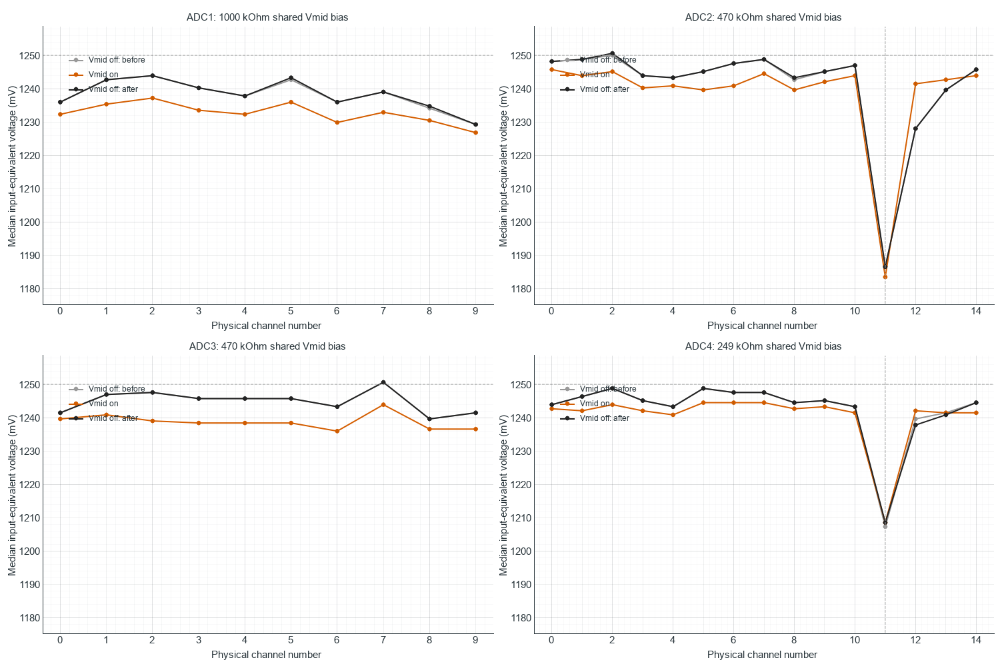

# TestBoard 7953: Vmid control with sensor strips attached

Measured 2026-10-08 after the user reconnected both sensor array strips and
reported that the sensors remained unstressed. The full off/on/off control
was repeated with the standalone benchmark. Vmid insertion does not remove
the large ADC2/ADC4 channel-11 deficit with sensors attached. Its effect on
channel 11 is much smaller than in the preceding unplugged-strip test.

## Method

The configuration matches the preceding control: both arrays, all 50 normal
ADC-ordered routes, 10 MHz SPI, blocking engine, manual mode, repeat 1,
nominal 2.5 V reference and profiling off. The GUI is disconnected and the
laptop is charging. Each capture has one second warm-up and twelve seconds
measured. The order is optional Vmid insertion off, on, then off again.
Recorded configuration fields match the unplugged-strip controls.

The existing firmware inserts two channel-15 operations after every
sensor-channel command when `vmid true` is selected. Their results are
discarded; the unchanged payload retains 50 sensor-route values. Reference
insertion therefore does not export independent Vmid samples. Mandatory
end-of-stream parking remains active with optional insertion off. No
firmware, GUI or wire-protocol change was made for this test.

Baseline values are medians after warm-up. Nominal voltage conversion is
2500/4096 = 0.6103515625 mV per count. Actual Vref/Vmid, analog-node voltages,
per-channel CS timing and mechanical stress were not independently measured.

## Channel 11 and its neighbors

| ADC / channel | Off before, counts | On, counts | Off after, counts | On minus mean off controls, mV |
| --- | ---: | ---: | ---: | ---: |
| ADC2 / 10 | 2043 | 2038 | 2043 | -3.05 |
| ADC2 / 11 | 1944 | 1939 | 1944 | -3.05 |
| ADC2 / 12 | 2012 | 2034 | 2012 | +13.43 |
| ADC4 / 10 | 2037 | 2034 | 2037 | -1.83 |
| ADC4 / 11 | 1978 | 1980 | 1980 | +0.61 |
| ADC4 / 12 | 2031 | 2035 | 2028 | +3.36 |

ADC2 channel 11 shifts from 1186.52 to 1183.47 mV and returns exactly to
1186.52 mV. Its deficit relative to the median of the other ADC2 channels
is 58.90 mV in all three captures: it moves down with its peers rather than
recovering toward them.

ADC4 channel 11 changes from 1207.28 to 1208.50 mV, but remains at 1208.50 mV
in the final off control. The apparent two-count increase versus the first
control is therefore not a demonstrated reversible Vmid-specific effect.
Its deficit relative to peer medians is 37.54 / 33.87 / 36.32 mV off/on/off.

Channel 11 remains the lowest channel on both ADCs in every capture.
ADC2 channel 12, the next channel in the normal scan, shows a much larger
and fully reversible response: +22 counts, or +13.43 mV. ADC4 channel 12
also rises with insertion, but has three counts of drift between the off
controls; its on value is four to seven counts above those controls.

## All channels and comparison with unplugged strips

| ADC | Off-before channel spread, mV | On spread, mV | Off-after spread, mV |
| --- | ---: | ---: | ---: |
| ADC1 | 14.65 | 10.38 | 14.65 |
| ADC2 | 63.48 | 62.26 | 64.09 |
| ADC3 | 10.99 | 7.93 | 10.99 |
| ADC4 | 41.50 | 36.01 | 40.28 |

Spread is maximum minus minimum channel median, not time-domain noise.
Most channels shift downward with insertion, but the depressed channel-12
baselines rise. The off controls agree within one count on every channel
except ADC4 channel 11 (two counts) and channel 12 (three counts).

| Channel-11 response to Vmid insertion | Strips unplugged, mV | Strips attached, mV |
| --- | ---: | ---: |
| ADC2: on minus mean off controls | -31.74 | -3.05 |
| ADC4: on minus mean off controls | -8.24 | +0.61 |

The response to reference insertion changes substantially when the strips
are attached. The channel-11 offset itself persists, however, and cannot be
attributed solely to testing with the strips unplugged. ADC2 channel 12's
reversible recovery is consistent with reduced influence of the preceding
channel, but this experiment does not prove analog carryover: insertion
changes MUX history, digital command transitions, acquisition duration and
revisit cadence together. The existing shared high-resistance bias topology
remains relevant with attached sensors, whose impedance/loading was not
measured here. The physical mechanism that makes channel 11 most sensitive
remains unresolved.

Median received sweep period is unchanged from the previous control:
136 / 346 / 136 us, approximately 7.35 / 2.89 / 7.35 kHz per channel.
Median acquisition duration is 134 / 345 / 134 us. Optional insertion costs
about 61% of the original per-channel rate in this configuration.

## Validation and retained data

All three benchmarks report PASS. All 150 independently computed channel
medians match the benchmark channel CSVs. Independent checks validate raw
headers, route counts, 12-bit values, timestamp ordering and firmware frame
totals. There are no parser-invalid frames, resynchronizations, discarded
or trailing parser bytes, timestamp regressions, duplicate frames or invalid
timing frames. All ADC, returned-channel, SPI-start, transfer-timeout and
USB-write error counters are zero.

Retained raw sweeps are 95,555 / 37,562 / 95,467: 228,584 total sweeps and
11,429,200 sensor values. Firmware USB-busy discards are 35 / 9 / 121,
explicitly reconciled with sent/sampled frame totals. Maximum received
periods are 675 / 2072 / 3365 us; these include discarded transmission
frames. Maximum actual sampling periods are 137 / 347 / 137 us, with zero
actual sampling periods above 1 ms. Sampling and received-stream gaps are
reported separately.

- Capture root: `Arduino_Sketches/TestBoard_7953/benchmarks/results/noise_channel11_vmid_sensors_attached_20261008`, with `off_before`, `on` and `off_after` subdirectories containing raw binaries, benchmark reports, statuses and command logs.
- [Validated summaries, raw hashes and restored status](gui-noise-analysis/channel11_vmid_sensors_attached/comparison.json).
- [All 50 channel comparisons](gui-noise-analysis/channel11_vmid_sensors_attached/channel_baseline_comparison.csv).
- Each analysis subdirectory retains independent raw-wire and channel-CSV checks.
- Helpers: `.codex_test_tmp/run_channel11_vmid.py --sensors-attached` and `.codex_test_tmp/compare_channel11_vmid.py --sensors-attached`.
- [Previous unplugged-strip Vmid control](TESTBOARD_7953_VMID_BASELINE_RESULTS.md).
- [Firmware, channel-order and continuous-selection investigation](../../../reports/firmware/TESTBOARD_7953_CHANNEL11_FIRMWARE_REVIEW.md).

The final control restores all 50 ADC-ordered routes at 10 MHz,
blocking/manual/repeat 1, optional Vmid insertion off. The board is stopped
and COM3 closed and available to the GUI. Earlier captures are preserved.
