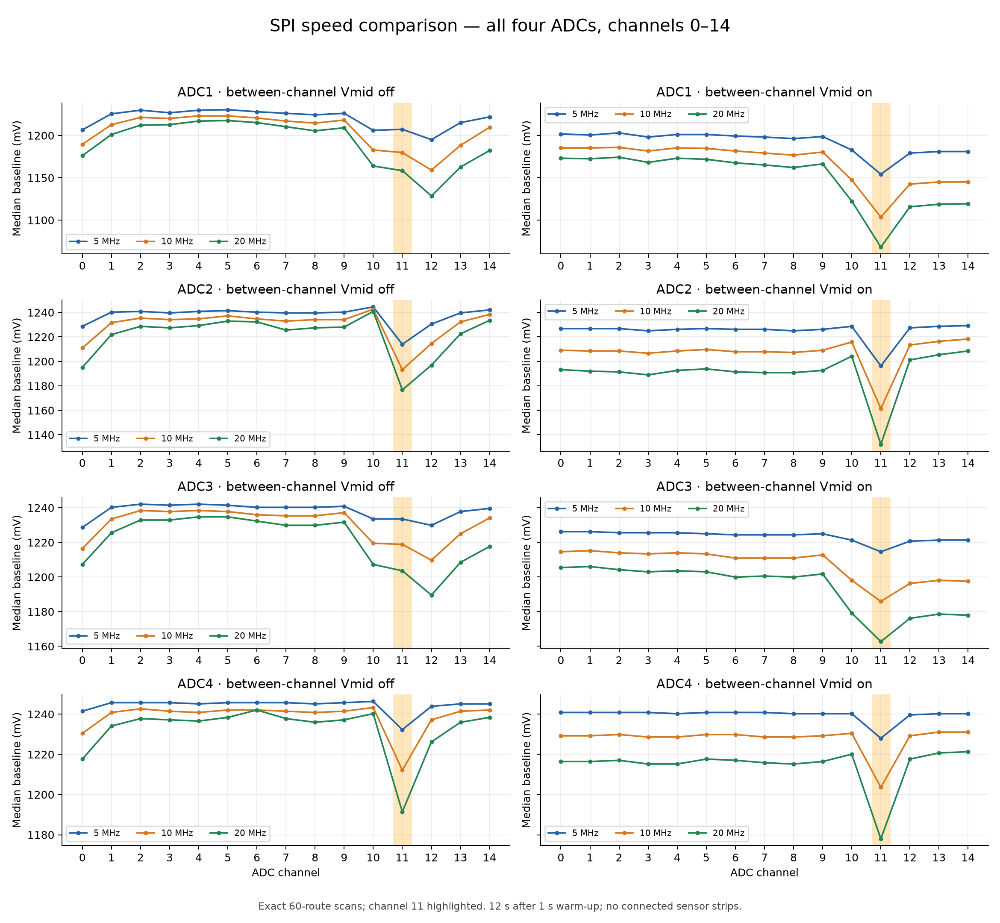
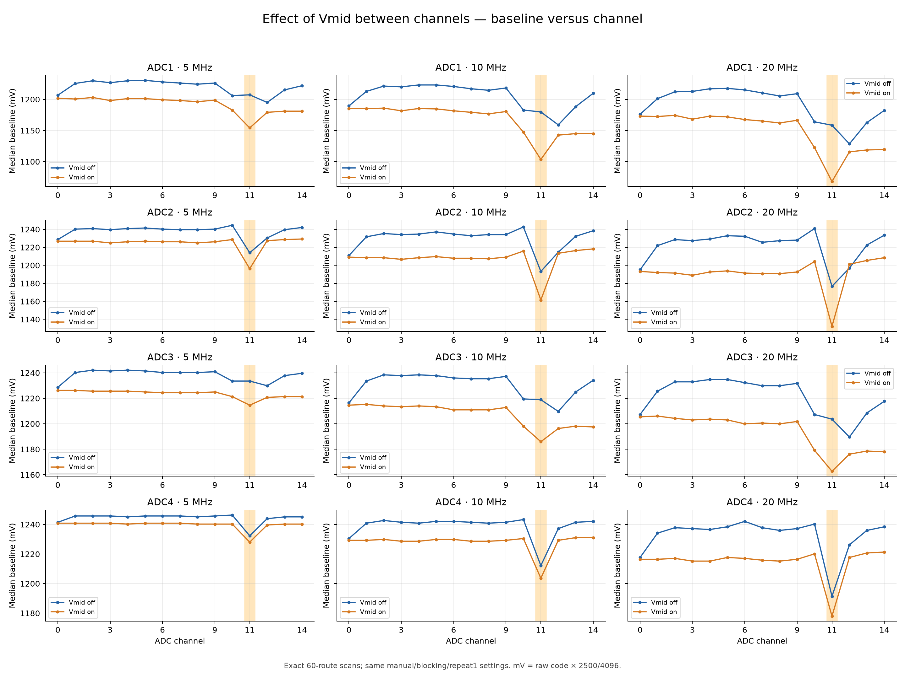
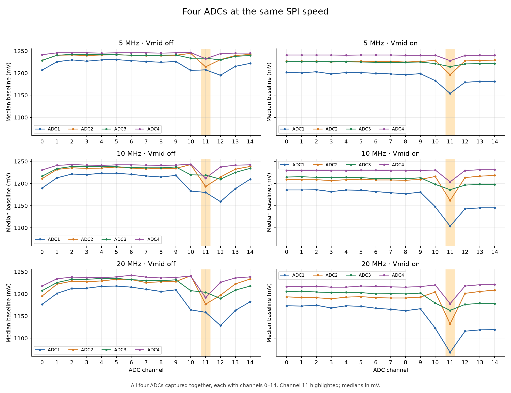
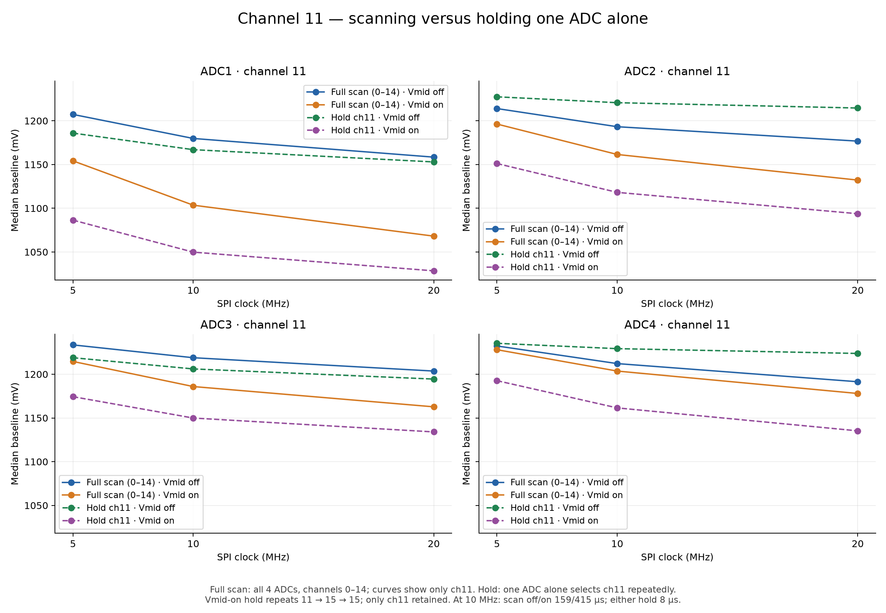
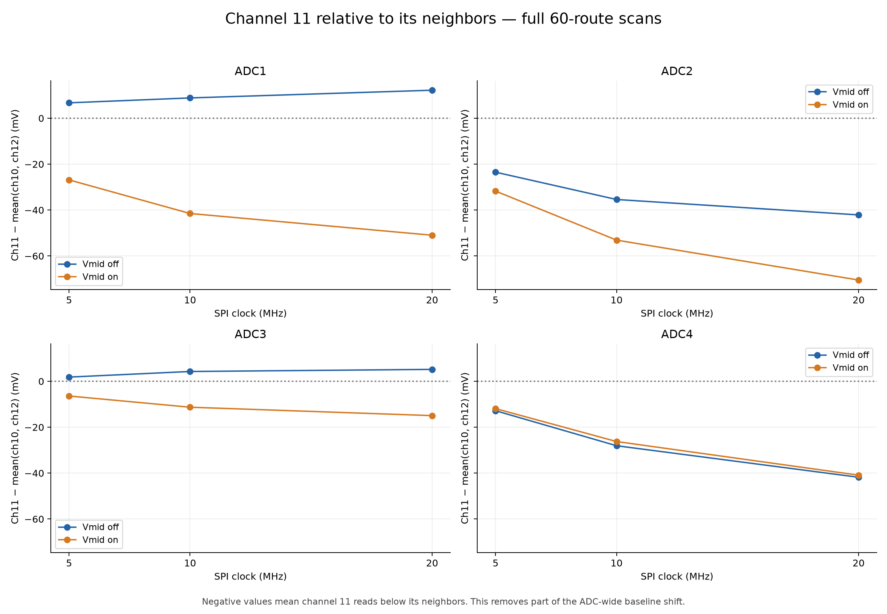
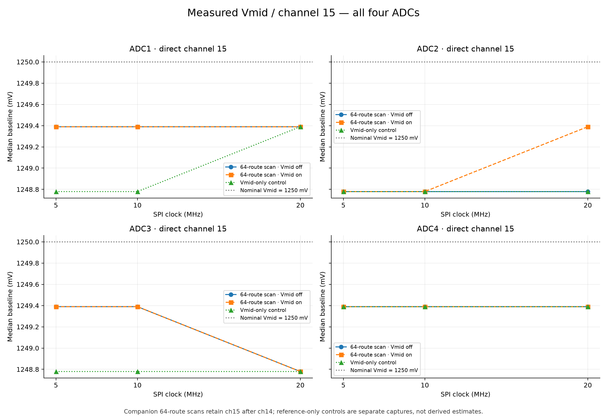
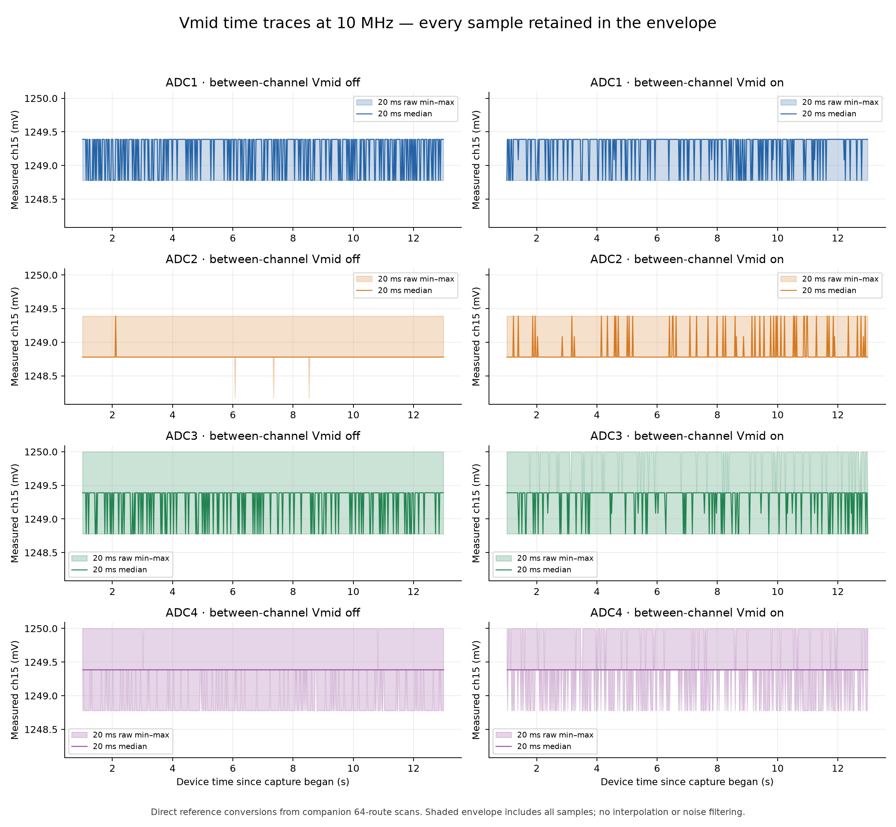

# TestBoard 7953 — four-ADC channel-11 investigation

2026-10-09. Both sensor strips disconnected; laptop charger connected; GUI closed.

| ADC | Vmid bias resistor | Channels routed to connector | PZT groups on connector |
|---|---|---|---|
| ADC1 | 1 MΩ | 0–9 | PZT6, PZT7 |
| ADC2 | 470 kΩ | 0–14 | PZT1, PZT3, PZT5 |
| ADC3 | 470 kΩ | 0–9 | PZT6, PZT7 |
| ADC4 | 249 kΩ | 0–14 | PZT1, PZT3, PZT5 |

This table describes the board wiring; both sensor strips were unplugged during these tests. Each bias resistor connects Vmid to the shared MXO / OPA365 input, rather than to individual channels. Channel 15 is the Vmid reference on every ADC.

**Result:** Channel 15 remains close to nominal Vmid while the floating-channel baselines depend strongly on SPI speed and selection history. Adding Vmid between samples lowers channel 11 further in every single-ADC hold comparison. ADC1 and ADC3 show this behavior too, so it is not restricted to ADC2/ADC4 or their SPI buses.

These disconnected-input tests support an analog settling/charge-history interpretation, but do not establish its exact mechanism. They do not show a channel-11-specific firmware delay or a host decoding fault.

[Download all seven graphs as one PDF](channel11_graphs.pdf) · [All channel measurements in mV](channel_measurements_mV.csv)

**Channel-specific distinction:** In Vmid-off full scans, channel 11 is below channels 10/12 on ADC2 and ADC4, but slightly above their mean on ADC1 and ADC3 at every tested clock. ADC1/ADC3 instead have a lower channel 12 in the unused 10–14 region. With Vmid on, channel 11 falls below its neighbors on all four ADCs. This differs from a universal rule that firmware always makes channel 11 low.

## Tests and interpretation

- **Requested scan:** all four ADCs, each with channels 0–14 (60 routes), Vmid insertion off/on, at 5/10/20 MHz.
- **Continuous channel 11:** each ADC tested alone at all three clocks, off/on. Off repeatedly selects channel 11; on selects 11 then Vmid twice. The start/stop Vmid parking is outside the measured window. With two ADCs active on one bus, mandatory parking would prevent a true continuous hold.
- **Reference companions:** channels 0–15 on each ADC (64 routes), off/on at each speed; channel 15 explicitly retained after channel 14. This adds one conversion per ADC with insertion off and three with insertion on. It is a separate control, not the identical 60-route sequence. Only the explicit channel-15 route is exported; the other inserted reference conversions remain discarded.
- **Reference-only controls:** channel 15 on all four ADCs at each speed; separate captures.
- **Drift check:** repeat the 10 MHz, 60-route, Vmid-off scan at the end.
- Every run uses manual sequence, blocking SPI, repeat 1, 2.5 V range, profiling off; 1 s warm-up followed by 12 s measurement.

All individual MUX inputs are open. One Vmid bias resistor is connected at each common MXO / OPA365 input: ADC1 1 MΩ, ADC2/3 470 kΩ, ADC4 249 kΩ. These are not fifteen independently driven Vmid inputs. The unused channels on ADC1/ADC3 also lack the populated sensor routing of ADC2/ADC4. Different resistance, routing and input capacitance can affect this comparison.

Voltages use nominal **2500/4096 mV per ADC count**. Absolute voltage is not independently calibrated. Medians summarize the complete post-warm-up capture; noise statistics in the CSV are AC standard deviation and full captured peak-to-peak, not baseline spread.

## Channel 11 results (mV)

| ADC | SPI, MHz | Scan off | Scan on | Hold off | Hold on | Ch11 − neighbors, off | Ch11 − neighbors, on |
|---|---:|---:|---:|---:|---:|---:|---:|
| 1 | 5 | 1207.28 | 1154.17 | 1185.91 | 1086.43 | 6.71 | -26.86 |
| 1 | 10 | 1179.81 | 1103.52 | 1166.99 | 1049.80 | 8.85 | -41.50 |
| 1 | 20 | 1158.45 | 1068.12 | 1152.95 | 1028.44 | 12.21 | -50.96 |
| 2 | 5 | 1213.99 | 1196.29 | 1227.42 | 1151.12 | -23.50 | -31.74 |
| 2 | 10 | 1193.24 | 1161.50 | 1220.70 | 1118.16 | -35.40 | -53.10 |
| 2 | 20 | 1176.76 | 1132.20 | 1214.60 | 1093.75 | -42.11 | -70.50 |
| 3 | 5 | 1233.52 | 1214.60 | 1218.87 | 1174.32 | 1.83 | -6.41 |
| 3 | 10 | 1218.87 | 1185.91 | 1206.05 | 1149.90 | 4.27 | -11.29 |
| 3 | 20 | 1203.61 | 1162.72 | 1194.46 | 1134.03 | 5.19 | -14.95 |
| 4 | 5 | 1232.30 | 1228.03 | 1235.35 | 1192.63 | -12.82 | -11.90 |
| 4 | 10 | 1212.16 | 1203.61 | 1229.25 | 1161.50 | -28.08 | -26.25 |
| 4 | 20 | 1191.41 | 1177.98 | 1223.75 | 1135.25 | -41.81 | -40.89 |

Neighbors = mean of the channel-10 and channel-12 medians in the same scan. Hold results have a different acquisition cadence and only one ADC active; comparison with a scan changes both selection history and cadence. Within each hold pair, off/on use the same three-operation stream length.

## Measured reference and reproducibility

- Channel-15 medians across all reference captures: **1248.78–1249.39 mV**, versus nominal 1250 mV.
- Exporting the extra reference route changes channel 11 by at most **0.61 mV** versus the neighboring 60-route control in this matrix. The companion scan still has different timing; this does not validate every discarded transient reference conversion.
- Final 10 MHz off-control: maximum median change across all 60 channels **0.61 mV**. Channel-11 changes ADC1–4: +0.61, +0.00, +0.00, +0.00 mV.

## Timing and data checks

| SPI, MHz | Scan off: acquisition / period, µs | Scan on: acquisition / period, µs | Hold ch11 off/on period, µs |
|---:|---:|---:|---:|
| 5 | 267 / 269 | 706 / 708 | 13–13 |
| 10 | 157 / 159 | 413 / 415 | 8–8 |
| 20 | 101 / 102 | 264 / 265 | 6–6 |

**40 captures; 39,615,388 received sweeps; 90,768,414 retained values.** Every retained sample matches the existing benchmark parser and an independent NumPy wire decode. All frame headers, counts, 12-bit values, timestamps and firmware sent/discarded counters reconcile. No ADC/tag/SPI-start/timeout/USB-write errors were reported.

The firmware reported **3,638 whole-frame USB discards** (0.0092% of acquired sweeps); these are missing transmitted sweeps, not corrupted values. Maximum actual sampling period: **756 µs**; **0** actual periods over 1 ms. Received timestamp gaps may exceed the sampling period when complete frames are discarded.

## Firmware and remaining diagnosis

The temporary isolated build changes only reference-route validation and adds a diagnostic status marker. It reuses the existing sampling loop, returned-channel checks, ADC commands, payload order, framing and timestamp trailer. Digital tests passed 1,998 controller acquisition cases; the existing benchmark suite passed 23 tests.

**Production firmware was restored and verified:** stopped, normal 50 routes, 10 MHz, manual/blocking/repeat1, Vmid off. The diagnostic marker is absent, and production again rejects explicit channel-15 routes. COM3 is closed. Production firmware sources and existing GUI work are unchanged.

To isolate the mechanism, measure common MXO / buffer input and buffer output while comparing these configurations; check the ADC chip-select/clock timing alongside the analog settling waveform. A matched continuous-hold comparison of channels 10, 11 and 12 on each ADC would distinguish a channel-specific offset from a general high-rate floating-input effect. Testing driven or individually biased channel inputs would avoid interpreting floating-node behavior as sensor accuracy.

## Graphs

### SPI speeds: all channels

Each ADC, channels 0–14, at 5/10/20 MHz; Vmid off and on.

### Vmid off versus on

The same clock and routes; each ADC plotted separately.

### Four ADCs at the same SPI speed

All four ADCs overlaid, including previously unused channels 10–14 on ADC1/ADC3.

### Channel 11: full scanning versus continuous selection

Full scan: all four ADCs scan channels 0–14, with only channel 11 shown here. Hold: one ADC alone selects channel 11 repeatedly; with Vmid on, it repeats 11 → 15 → 15 and retains only channel 11. At 10 MHz, a full scan produces one channel-11 result per ADC about every 159 µs with Vmid off or 415 µs with Vmid on. Either single-ADC hold mode produces a retained channel-11 result about every 8 µs. Comparing a scan with a hold therefore changes both selection history and sampling cadence.

### Channel 11 relative to channels 10 and 12

Negative values show a channel-11 deficit after removing the neighboring baseline level.

### Measured Vmid / channel 15

Companion full scans versus separate reference-only controls.

### Vmid time traces

10 MHz examples, all ADCs, Vmid off/on; every raw sample contributes to each 20 ms min–max envelope.

